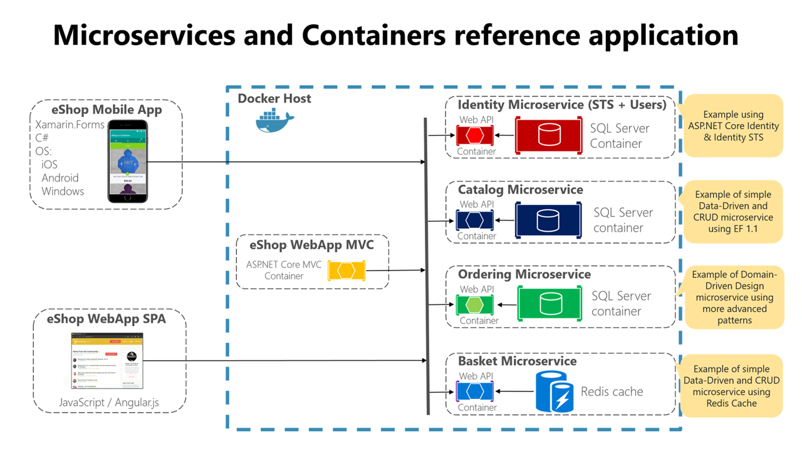
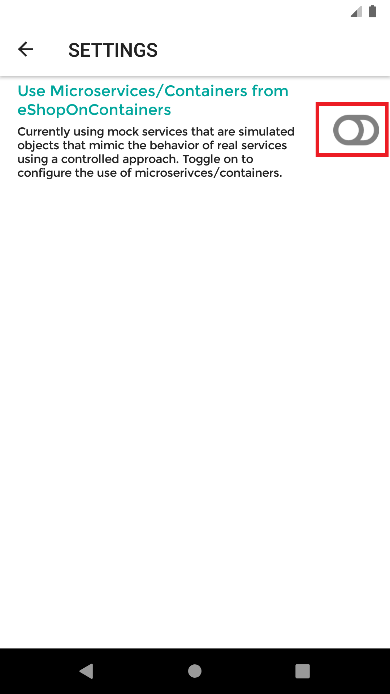
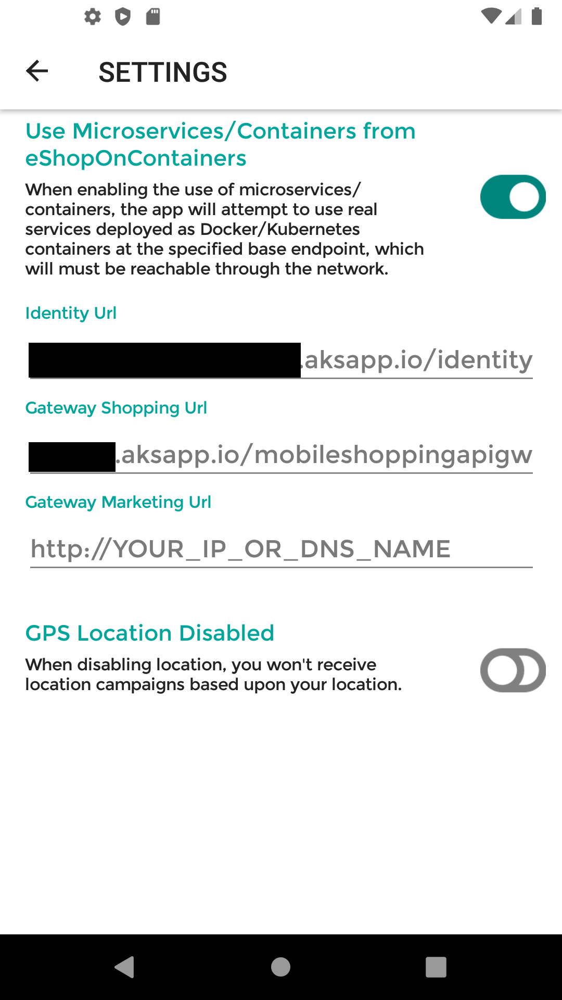
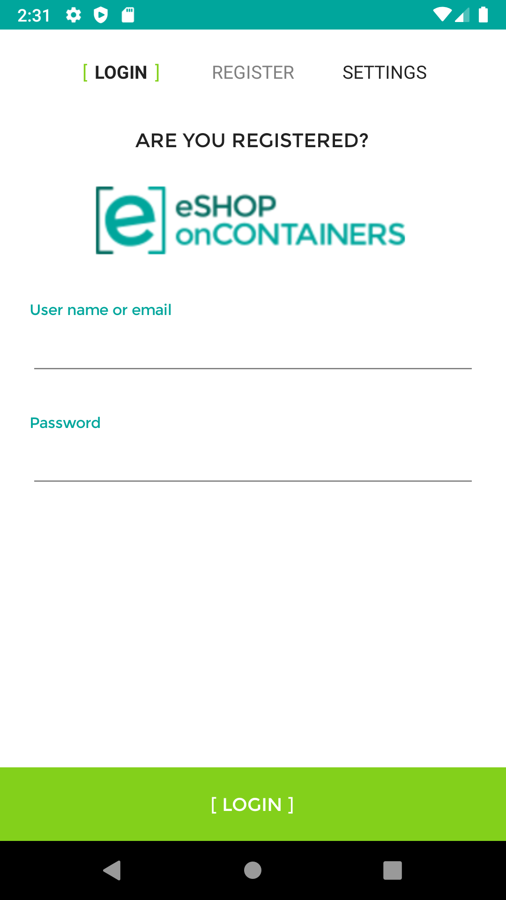
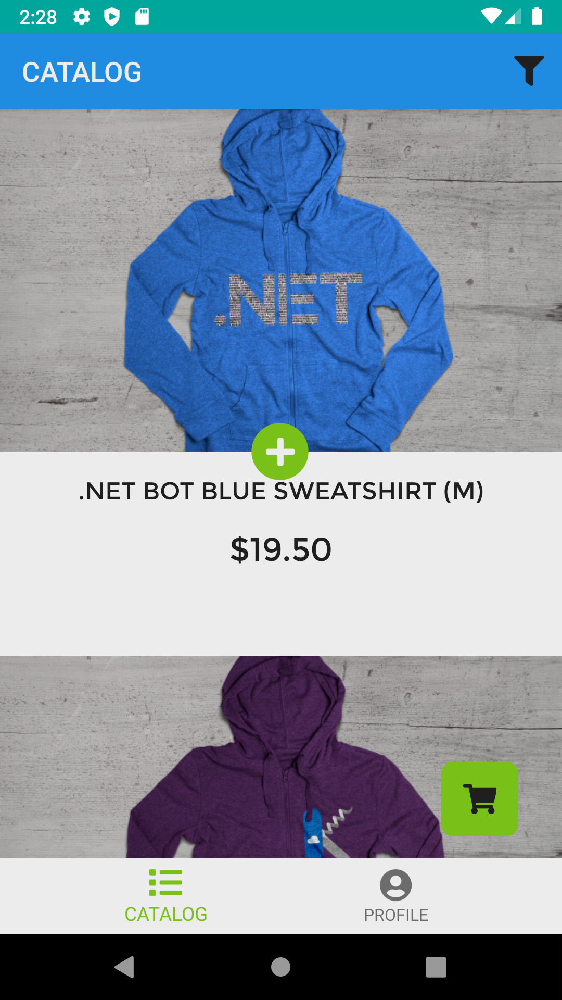
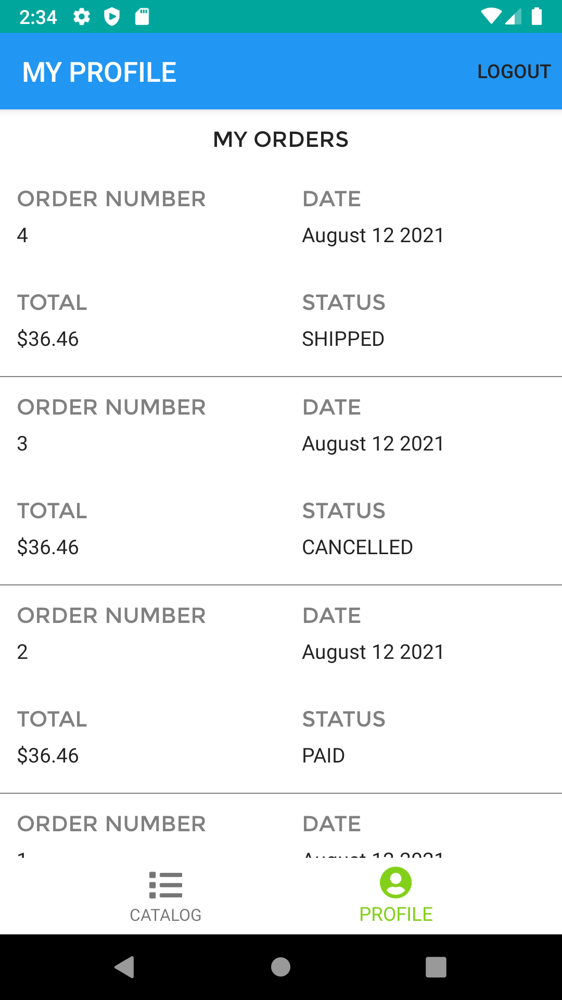

# eshop-mobile-client

`eshop-mobile-client` is a reference mobile client app whose imagined purpose is to serve the mobile workforce of a fictitious company that sells products. The app allows you to manage the catalog, view products, and manage the basket and the orders.

# Dependencies

Though `eshop-mobile-client` mobile app relies on the repo [eShopOnContainers](https://github.com/dotnet-architecture/eShopOnContainers) for it's backend but by default it uses its internal MockServices for all it's functionalities. For more details refer to the [Setup](https://github.com/dotnet-architecture/eshop-mobile-client#setup) section.



## Architecture

The app architecture consists of two parts:

  1. A Xamarin.Forms mobile app for iOS, Android, and Windows.
  2. Several .NET Web API microservices deployed as Docker containers.

### Xamarin.Forms App

This project exercises the following platforms, frameworks or features:

* Xamarin.Forms
  * XAML
  * Behaviors
  * Bindings
  * Converters
  * Central Styles
  * Custom Renderers
  * Animations
  * IoC
  * Messaging Center
  * Custom Controls
  * Cross Plugins
  * XFGloss
* xUnit Tests
* Azure Mobile Services
  * C# backend
  * WebAPI
  * Entity Framework
  * Identity Server 4

### Backend Services

All the backend services related code and components are maintained as [eShopOnContainers](https://github.com/dotnet-architecture/eShopOnContainers) repo.

## Supported platforms

The app targets **three** platforms:

* iOS
* Android
* Universal Windows Platform (UWP)
  * UWP supported only in Visual Studio, not Xamarin Studio or Visual Studio for MacOS

As of now, eShopOnContainers features **89.2% code share** (7.2% iOS / 16.7% Android / 8.7% Windows).

## Requirements

* [Visual Studio 19.0](https://visualstudio.microsoft.com/vs/) (19.0 or higher) to compile C# language features (or Visual Studio MacOS)
* Xamarin add-ons for Visual Studio (available via the Visual Studio installer)
* __Visual Studio Community Edition is fully supported!__
* [Android SDK Tools](https://developer.xamarin.com/guides/android/getting_started/installation/windows/) 25.2.3 or higher
* JDK 8.0

## Setup

### 1. Ensure the Xamarin platform is installed

You can do that by following the steps mentioned in [Installing Xamarin](https://docs.microsoft.com/en-us/xamarin/get-started/installation/?pivots=windows)

### 2. Ensure Xamarin are updated

Xamarin will periodically automatically check for updates. You can also manually check for updates.


### 3. Project Setup

Restore NuGet packages for the project.

### 4. Ensure Android Emulator is installed

You can use any Android emulator although it is highly recommended to use an x86 based version.


>**Note**: The Visual Studio Android Emulator cannot run well inside a virtual machine or over Remote Desktop or VNC since it relies on virtualization and OpenGL.

To deploy and debug the application on a physical device, refer to the [Debug on an Android device](https://docs.microsoft.com/xamarin/android/deploy-test/debugging/debug-on-device) article.

### 5. Ensure Mac connection

To set up the Mac host, you must enable communication between the Xamarin extension for Visual Studio and your Mac.


### 6. Use Actual Microservices

By default `eshop` mobile client uses the internal Mockservices to let the user to explore different set of features in of the app.

But if you want to test out the app using with the real services you can do that too. 

For that you'll need to do the following:

1) Deploy the backend services of `eShop` applications from the [eShopOnContainers](https://github.com/dotnet-architecture/eShopOnContainers) repo. You can deploy the application to either [Local Kubernetes](https://github.com/dotnet-architecture/eShopOnContainers/wiki/Deploy-to-Local-Kubernetes) or [AKS](https://github.com/dotnet-architecture/eShopOnContainers/wiki/Deploy-to-Azure-Kubernetes-Service-(AKS)) environment. 
   
2) Enable microservies endpoint in the `Settings` section.

  

  

  Identity Url : `http://<YOUR_IP_OR_DNS_NAME>/identity`
  Mobile Gateway Shopping Url: `http://<YOUR_IP_OR_DNS_NAME>/mobileshoppingapigw`

3) Enable HTTP traffic.
   
  #### Andriod App:

   You'll also need to include the `<YOUR_IP_OR_DNS_NAME>` in the section `<domain includeSubdomains="true"><YOUR_IP_OR_DNS_NAME></domain>` of the `network_security_config.xml` file to use `HTTP` traffic. 
  
   For more details refer to [Managing HTTP & Cleartext Traffic on Android with Network Security Configuration](https://devblogs.microsoft.com/xamarin/cleartext-http-android-network-security/)
  
  #### IOS App:

  You'll need to make sure your `info.plist` file contains following configuration.

  ```xml
    ....
    <key>NSAppTransportSecurity</key>
    <dict>
      <key>NSAllowsArbitraryLoads</key>
      <true/>
    </dict>
    ..
  ```
  For more details refer to [Opting-Out of ATS](https://docs.microsoft.com/en-us/xamarin/ios/app-fundamentals/ats?WT.mc_id=docs-xamarinblog-jamont#opting-out-of-ats)

> **NOTE:** Please note, in production scenario you'll the services which uses `HTTPS` endpoint.

## Screens

The app has the following screens:

* a auth screen
* a login prompt
* a catalog list
* a profile section with a order list
* a readonly order detail screen
* a customizable basket
* a checkout screen








## Clean and Rebuild

If you see build issues when pulling updates from the repo, try cleaning and rebuilding the solution.

## Troubleshooting

**Unsupported major.minor version 52.0**

So, you just downloaded the source code and ready to build the application and...


There are two possible fixes.

The first one is based on updating Java JDK and ensure its use. The version 52.0 referenced in the error refers to the JDK, specifically to version 8. Xamarin Android 7.0 requires the JDK 1.8 to use the Android Nougat APIs (API Level 24). It's also necessary a 64-bit version to be able to use personal controls in the Android editor among other actions.

Download the corresponding version of the JDK in this [link](http://www.oracle.com/technetwork/java/javase/downloads/jdk8-downloads-2133151.html).

After downloading and installing, you must ensure that the installed version is used. For that:

Visual Studio: Tools> Options> Xamarin> Android Settings> Java Development Kit Location.
Xamarin Studio (on Mac): Xamarin Studio> Preferences> Projects> SDK Locations> Android> Java SDK (JDK).

The second way is based on using Android 6.0 or what is the same API Level 23.

**Could not connect to the debugger using Android Hyper-V emulators**

The application performs the deployment and even boots into the emulator, but stops immediately without allowing debugging. We get the message:


The error is related with incompatibilities between the host processor and the Hyper-V virtual machine.

In Windows 10, we press the start button and write MMC. Next, click the Hyper-V Manager option:


In the Hyper-V machine management tool (emulators), select the one that you want to use and right click, Settings.


In the configuration window of the machine, go to the Compatibility section and enable **Migrate to a physical computer with a different processor version**:


## Licenses

This project uses some third-party assets with a license that requires attribution:

* [Xamarin.Plugins](https://github.com/jamesmontemagno/Xamarin.Plugins): by James Montemagno
* [FFImageLoading](https://github.com/daniel-luberda/FFImageLoading): by Daniel Luberda
* [ACR User Dialogs](https://github.com/aritchie/userdialogs): by Allan Ritchie
* [Xamarin.Forms Animation Helpers](https://github.com/jsuarezruiz/Xamanimation): by Javier Suárez
* [SlideOverKit](https://github.com/XAM-Consulting/SlideOverKit): by XAM-Consulting

## Copyright and license

* Code and documentation copyright 2021 Microsoft Corp. Code released under the [MIT license](https://opensource.org/licenses/MIT).
