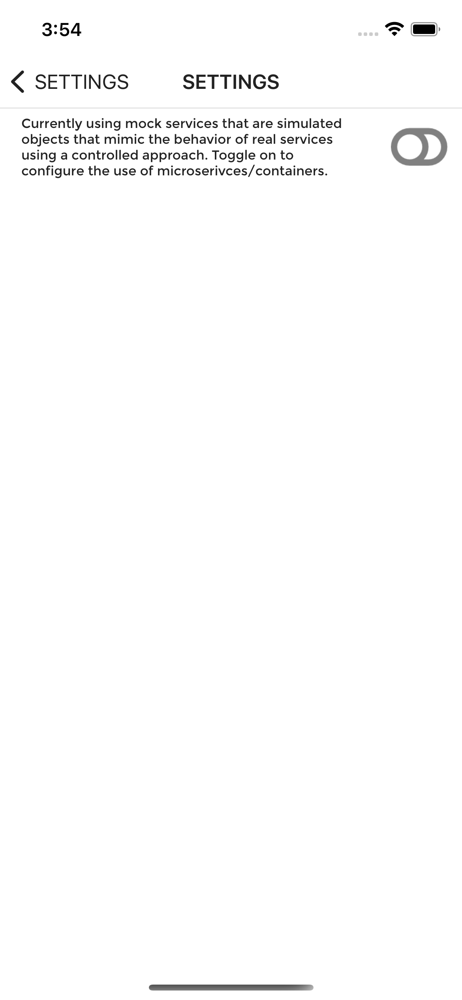
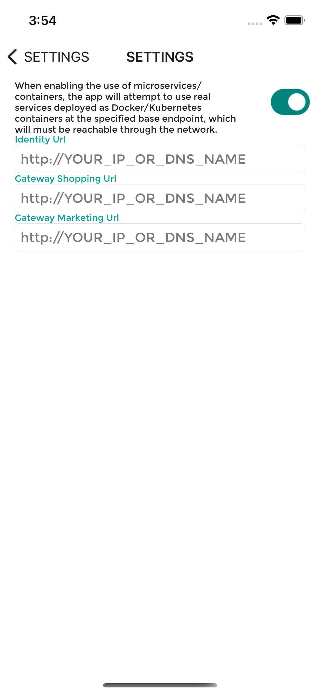
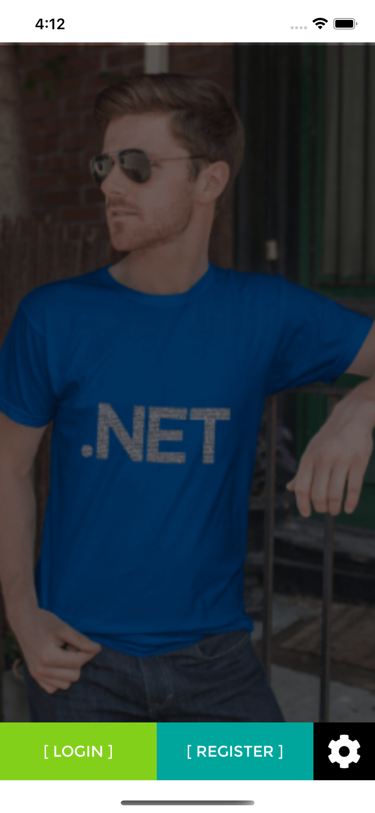
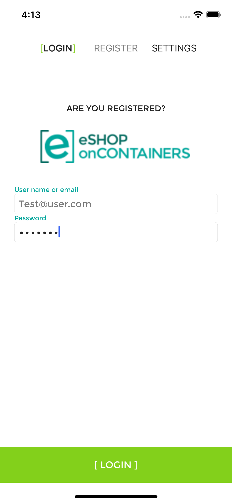
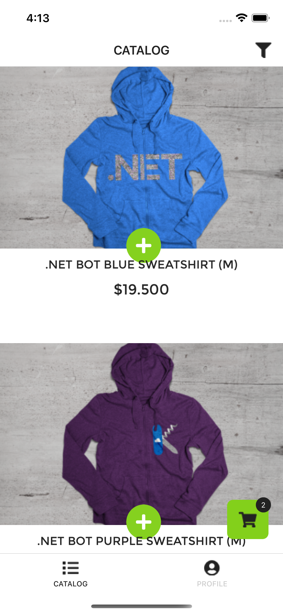
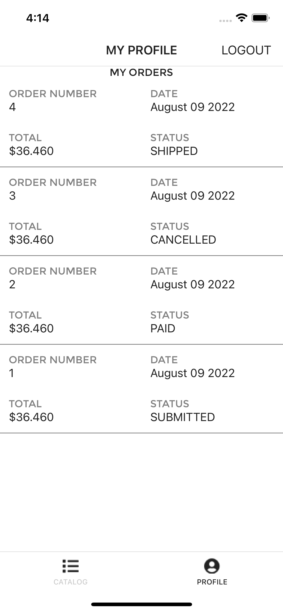
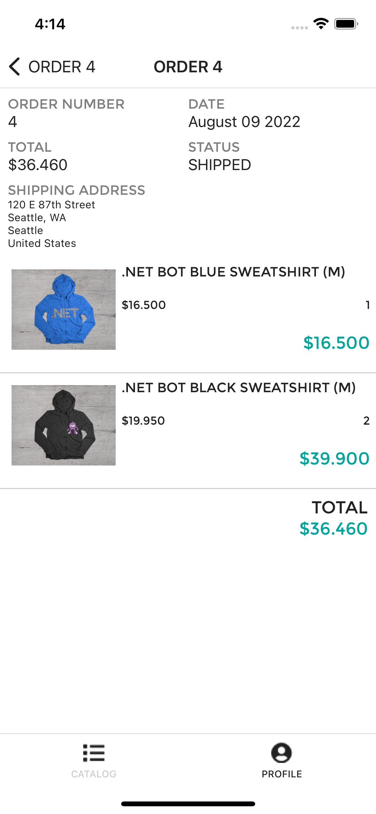

# eshop-mobile-client

`eshop-mobile-client` is a reference .NET MAUI multi-platform client app whose imagined purpose is to serve the mobile workforce of a fictitious company that sells products. The app allows you to manage the catalog, view products, and manage the basket and the orders.

# Dependencies

Though `eshop-mobile-client` mobile app relies on the repo [eShopOnContainers](https://github.com/dotnet-architecture/eShopOnContainers) for it's backend but by default it uses its internal MockServices for all it's functionalities. For more details refer to the [Setup](https://github.com/dotnet-architecture/eshop-mobile-client#setup) section.


## Architecture

The app architecture consists of two parts:

  1. A .NET MAUI mobile app for iOS, macOS, Android, and Windows.
  2. Several .NET Web API microservices which are deployed as Docker containers.

### .NET MAUI App

This project exercises the following platforms, frameworks, and features:

* .NET MAUI
  * XAML
  * Behaviors
  * Bindings
  * Converters
  * Central Styles
  * Animations
  * IoC
  * Messaging Center
  * Custom Controls
  * xUnit Tests
* Azure Mobile Services
  * C# backend
  * WebAPI
  * Entity Framework
  * Identity Server 4

### Backend Services

All the backend services-related code and components are maintained as [eShopOnContainers](https://github.com/dotnet-architecture/eShopOnContainers) repo.

## Supported platforms

The app targets **three** platforms:

* iOS
* macOS
* Android
* Universal Windows Platform (UWP)
  * UWP is supported only in Visual Studio for Windows, not Visual Studio for macOS

## Requirements

* [Visual Studio 2022](https://visualstudio.microsoft.com/vs/) (2022 or higher) to compile C# language features (or Visual Studio MacOS)
    * __Visual Studio Community Edition is fully supported!__
* .NET MAUI add-ons for Visual Studio (available via the Visual Studio installer)

## Setup

### 1. Ensure the .NET MAUI platform is installed

You can do that by following the steps mentioned in [Installing .NET MAUI](https://dotnet.microsoft.com/en-us/learn/maui/first-app-tutorial/install)

### 2. Ensure .NET MAUI is updated

Visual Studio will periodically automatically check for updates. You can also manually check for updates using the [Update Visual Studio](https://docs.microsoft.com/en-us/visualstudio/install/update-visual-studio) options.

### 3. Project Setup

Restore NuGet packages for the project.

### 4. Ensure Android Emulator is installed

You can use any Android emulator although it is highly recommended to use an x86-based version.


>**Note**: The Visual Studio Android Emulator cannot run well inside a virtual machine or over Remote Desktop or VNC since it relies on virtualization and OpenGL.

To deploy and debug the application on a physical device, refer to the [Debug on an Android device](https://docs.microsoft.com/xamarin/android/deploy-test/debugging/debug-on-device) article.

### 5. Ensure Mac connection

To set up the Mac host, you must enable communication between the Xamarin extension for Visual Studio and your Mac.


### 6. Use Actual Microservices

By default `eshop` multiplatform client uses the internal mock services to let the user explore different sets of features in the app.

But if you want to test out the app using the real services you can do that too.

For that you'll need to do the following:

1) Deploy the backend services of `eShop` applications from the [eShopOnContainers](https://github.com/dotnet-architecture/eShopOnContainers) repo. You can deploy the application to either [Local Kubernetes](https://github.com/dotnet-architecture/eShopOnContainers/wiki/Deploy-to-Local-Kubernetes) or [AKS](https://github.com/dotnet-architecture/eShopOnContainers/wiki/Deploy-to-Azure-Kubernetes-Service-(AKS)) environments.

2) Enable microservies endpoint in the `Settings` section.

  

  

  Identity Url : `http://<YOUR_IP_OR_DNS_NAME>/identity`
  Mobile Gateway Shopping Url: `http://<YOUR_IP_OR_DNS_NAME>/mobileshoppingapi`

3) Enable HTTP traffic.

  #### Android App

   You'll also need to include the `<YOUR_IP_OR_DNS_NAME>` in the section `<domain includeSubdomains="true"><YOUR_IP_OR_DNS_NAME></domain>` of the `network_security_config.xml` file to use `HTTP` traffic. 
  
   For more details refer to [Managing HTTP & Cleartext Traffic on Android with Network Security Configuration](https://devblogs.microsoft.com/xamarin/cleartext-http-android-network-security/)
  
  #### IOS App

  You'll need to make sure your `info.plist` file contains following configuration.

  ```xml
    <key>NSAppTransportSecurity</key>
    <dict>
      <key>NSAllowsArbitraryLoads</key>
      <true/>
    </dict>
  ```
  For more details refer to [Opting-Out of ATS](https://docs.microsoft.com/en-us/xamarin/ios/app-fundamentals/ats?WT.mc_id=docs-xamarinblog-jamont#opting-out-of-ats)

> **NOTE:** Please note, in production scenario you'll the services which uses `HTTPS` endpoint.

## Screenshots







## Clean and Rebuild

If you see build issues when pulling updates from the repo, try cleaning and rebuilding the solution.

## Troubleshooting


## Licenses

This project uses some third-party assets with a license that requires attribution:

* [.NET MAUI Community Toolkit](https://github.com/CommunityToolkit/Maui)
* [MVVM Community Toolkit](https://github.com/CommunityToolkit/WindowsCommunityToolkit)
* [PCLCrypto](https://github.com/AArnott/PCLCrypto)
* [IdentityModel](https://github.com/IdentityModel)

## Copyright and license

* Code and documentation copyright 2022 Microsoft Corp. Code released under the [MIT license](https://opensource.org/licenses/MIT).
