# Migrating eShop From Xamarin.Forms to MAUI

## Create New eShopContainers Solution

### Overview

In order to get our Xamarin.Forms application migrated, we will want to start by creating a new MAUI solution.

> [!Important]
> You will want to make sure that the new solution name matches up to the root namespace of the existing application. This will ensure that we are able to import existing components later on with as little friction as possible.

### macOS

In a terminal, execute the following command to generate a new MAUI program

```dotnetcli
dotnet new maui -n eShopOnContainers
```

### Visual Studio 2022

> [!CAUTION]
> This can be done using the templates in Visual Studio 2022 and needs documentation...

## Navigating the Solution

The new solution will be created and will contain an `eShopOnContainers.sln` file that can be opened with Visual Studio 2022 on Windows or Mac.

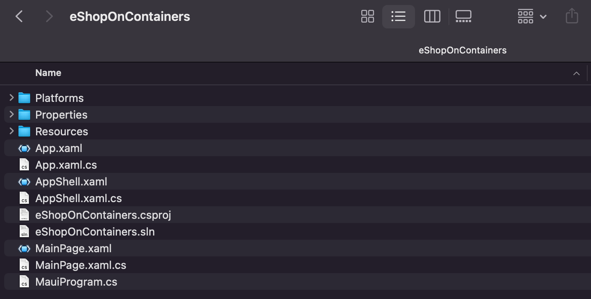

Our newly generated solution will contain a simple MAUI application. MAUI projects have a new structure, consolidating all platform-specific projects into a singular project. All platform-specific have been moved to the `Platforms` folder. Writing any iOS, Android, or Windows code and configurations specifically for those platforms in this folder is still possible. The `Resources` folder will hold any non-code files needed for the application, such as images, fonts, database files, etc.

## Migrating Existing XAML and Code

The first step we will need to take is to bring our existing application's XAML and source code over. We will be specifically migrating the contents of the `eShopOnContainers.Core` project first, as this contains the bulk of our Xamarin.Forms application. Below is a list of all the files and folders we will migrate from this project.

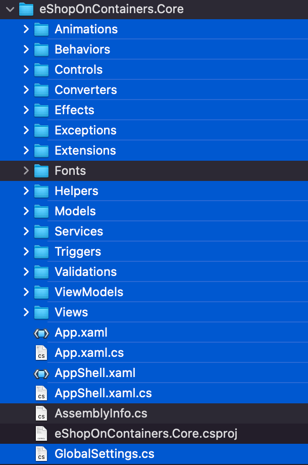

> [!NOTE]
> We will not be directly migrating the `Fonts` folder, `AssemblyInfo.cs`, and `eShopOnContainers.Core.csproj`. Their contents will be migrated at a later step.

> [!TIP]
> It would be a good idea to make sure that you have the MAUI project added to a source control provider and that you make sure to regularly check-in changes along the way of the migration. This will make it easy to rollback to earlier changes or perform some trial-and-error.

Using the file explorer, drag-and-drop the contents listed above from the existing project to the root folder of your new MAUI project. The folder contents will look like the figure below.

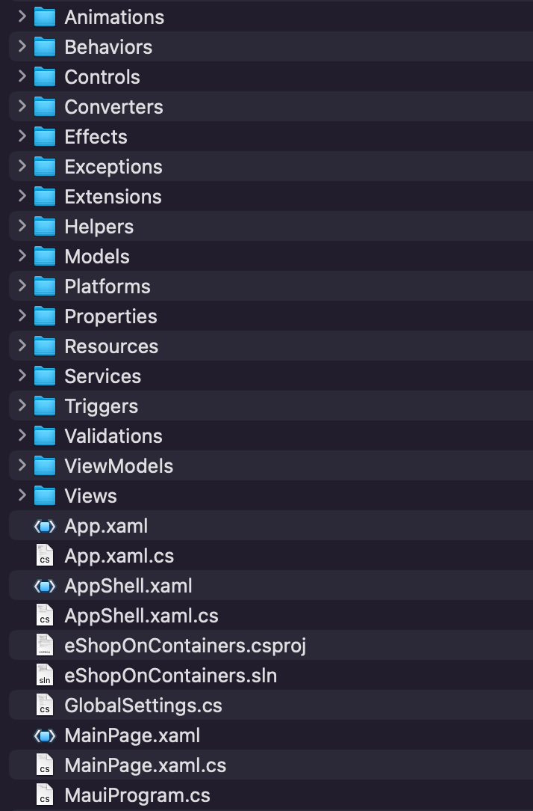

### Core Xamarin.Forms Code Migration Steps

1. Replace the following Xamarin.Forms information with the Microsoft MAUI equivalent:

    | Old Value | New Value |
    | --- | --- |
    | `xmlns="http://xamarin.com/schemas/2014/forms"` | `xmlns="http://schemas.microsoft.com/dotnet/2021/maui"` |
    | `xmlns:windows="clr-namespace:Xamarin.Forms.PlatformConfiguration.WindowsSpecific;assembly=Xamarin.Forms.Core"`| Replace with an empty string |
    | `` | `xmlns:ios="clr-namespace:Microsoft.Maui.Controls.PlatformConfiguration.iOSSpecific;assembly=Microsoft.Maui.Controls"` |
    | `windows:Application.ImageDirectory="Assets"`| Replace with an empty string |
    | `xmlns:ffimageloading="clr-namespace:FFImageLoading.Forms;assembly=FFImageLoading.Forms"` | Replace with an empty string |
    | `using Xamarin.Forms` | `using Microsoft.Maui` |
    | `using Xamarin.Forms.Xaml` | `using Microsoft.Maui.Controls.Xaml` |
    | `using Xamarin.Essentials` | Replace with an empty string |
    | `using System.Drawing` | Replace with an empty string |
    | `Xamarin.Forms.DependencyService` | `Microsoft.Maui.Controls.DependencyService` |
    | `UWP, WinRT, WinPhone` | `WinUI` |
    | `UWP` | `WinUI` **Case Sensitive** |
    | `Uwp` | `WinUI` **Case Sensitive** |
    | `Color.Black` | `Colors.Black` |
    | `Color.White` | `Colors.White` |
    | `Color.Default` | `Colors.Transparent` |
    | `Xamarin.Forms.Easing` | `Microsoft.Maui.Easing` |
    | `Setter Property="BorderRadius"` | `Setter Property="CornerRadius"` |
    | `OSAppTheme.Dark` | `AppTheme.Dark` |
    | `new Rectangle` | `new Rect` |
    | `eShopOnContainers.Core` | `eShopOnContainers` |
    | `Core.` | Replace with an empty string |
    | `IDictionary<string, string> query` | `IDictionary<string, object> query` |

1. In `App.xaml.cs`, remove the following XAML

    ```XAML
    <Style ApplyToDerivedTypes="True" TargetType="mct:Popup">
        <Setter Property="BackgroundColor" Value="{AppThemeBinding Light={StaticResource LightBackgroundColor}, Dark={StaticResource DarkBackgroundColor}}" />
    </Style>
    ```

1. In `MauiProgram.cs`, update your builder to configure effects

    ```csharp
    using CommunityToolkit.Maui;
    
    namespace eShopOnContainers;
    
    public static class MauiProgram
    {
        public static MauiApp CreateMauiApp()
        {
            var builder = MauiApp.CreateBuilder();
            builder
                .UseMauiApp<App>()
                .ConfigureEffects(
                    effects =>
                    {
                    })
                .ConfigureFonts(
                    fonts =>
                    {
                        fonts.AddFont("OpenSans-Regular.ttf", "OpenSansRegular");
                        fonts.AddFont("OpenSans-Semibold.ttf", "OpenSansSemibold");
                    });
    
            return builder.Build();
        }
    }
    ```

1. Migrate `Extensions\DictionaryExtensions.cs` to use new parameters that match the updated `IQueryAttributable` interface 

    ```csharp
    namespace eShopOnContainers.Extensions
    {
        public static class DictionaryExtensions
        {
            public static (bool ContainsKeyAndValue, bool Value) GetValueAsBool(this IDictionary<string, object> dictionary, string key)
            {
                return dictionary.ContainsKey(key)
                    ? (true, dictionary[key] is bool ? (bool)dictionary[key] : default(bool))
                    : (false, default);
            }
    
            public static (bool ContainsKeyAndValue, int Value) GetValueAsInt(this IDictionary<string, object> dictionary, string key)
            {
                return dictionary.ContainsKey(key)
                    ? (true, dictionary[key] is int ? (int)dictionary[key] : default(int))
                    : (false, default);
            }
        }
    }
    ```

1. Add in the `Newtonsoft.Json` nuget package
   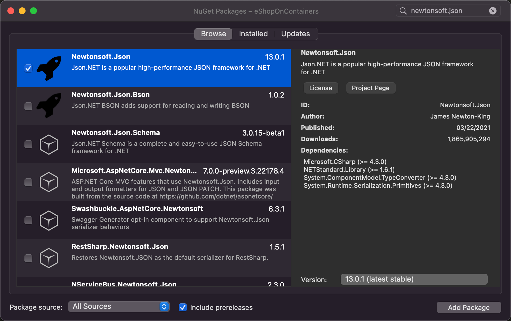

1. Add in the `IdentityModel` nuget package
   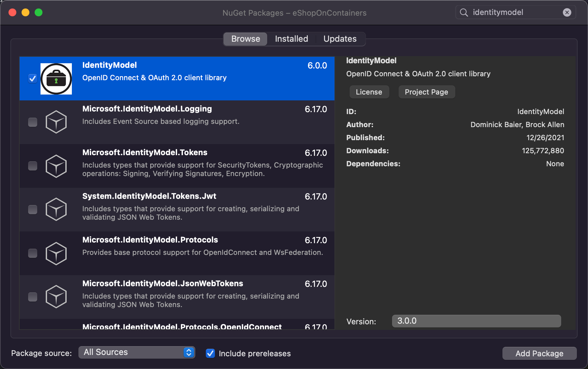

1. Add in the `PCLCrypto` nuget package
   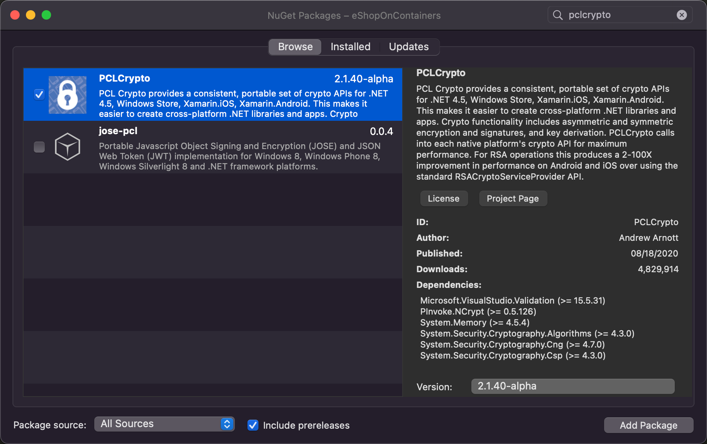

### Xamarin Community Toolkit Migration Steps

1. Add in the `Maui Community Toolkit` nuget package
   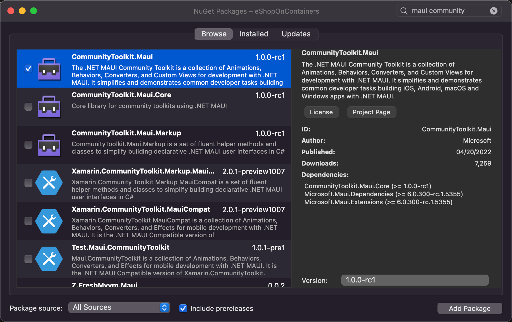

1. Replace the following Xamarin Community Toolkit information with the MAUI Community Toolkit equivalent:

    | Old namespace | New namespace |
    | --- | --- |
    | `xmlns:xct="http://xamarin.com/schemas/2020/toolkit"` | `xmlns:mct="http://schemas.microsoft.com/dotnet/2022/maui/toolkit"` |
    | `xct:` | `mct:` |
    | `xmlns:xtc="http://xamarin.com/schemas/2020/toolkit"` | `xmlns:mct="http://schemas.microsoft.com/dotnet/2022/maui/toolkit"` |
    | `xtc:` | `mct:` |
    | `using Xamarin.CommunityToolkit.UI.Views;` | `using CommunityToolkit.Maui.Views;` |
    | `using Xamarin.CommunityToolkit.Extensions;` | Replace with an empty string |
    | `Navigation.ShowPopup` | `this.ShowPopup` |
    | `mct:IsNullOrEmptyConverter` | `mct:IsStringNullOrEmptyConverter` |
    | `mct:ListIsNullOrEmptyConverter` | `mct:IsListNullOrEmptyConverter` |
    | `mct:ListIsNotNullOrEmptyConverter` | `mct:IsListNotNullOrEmptyConverter` |

1. In `MauiProgram.cs`, update your builder to use the MAUI Community toolkit.

    ```csharp
    using CommunityToolkit.Maui;
    
    namespace eShopOnContainers;
    
    public static class MauiProgram
    {
        public static MauiApp CreateMauiApp()
        {
            var builder = MauiApp.CreateBuilder();
            builder
                .UseMauiApp<App>()
                .ConfigureEffects(
                    effects =>
                    {
                    })
                .UseMauiCommunityToolkit()
                .ConfigureFonts(
                    fonts =>
                    {
                        fonts.AddFont("OpenSans-Regular.ttf", "OpenSansRegular");
                        fonts.AddFont("OpenSans-Semibold.ttf", "OpenSansSemibold");
                    });
    
            return builder.Build();
        }
    }
    ```

1. Update the `Converters\WebNavigatedEventArgsConverter.cs` and `Converters\WebNavigatingEventArgsConverter.cs` to use `ICommunityToolkitValueConverter`

    ```csharp
    using System.Globalization;
    using CommunityToolkit.Maui.Converters;
    
    namespace eShopOnContainers.Converters
    {
        public class WebNavigatedEventArgsConverter : ICommunityToolkitValueConverter
        {
            public object Convert(object value, Type targetType, object parameter, CultureInfo culture)
            {
                var eventArgs = value as WebNavigatedEventArgs;
                if (eventArgs == null)
                    throw new ArgumentException("Expected WebNavigatedEventArgs as value", "value");
    
                return eventArgs.Url;
            }
    
            public object ConvertBack(object value, Type targetType, object parameter, CultureInfo culture)
            {
                throw new NotImplementedException();
            }
        }
    }
    ```

    ```csharp
    using System.Globalization;
    using CommunityToolkit.Maui.Converters;
    
    namespace eShopOnContainers.Converters
    {
        public class WebNavigatingEventArgsConverter : ICommunityToolkitValueConverter
        {
            public object Convert(object value, Type targetType, object parameter, CultureInfo culture)
            {
                var eventArgs = value as WebNavigatingEventArgs;
                if (eventArgs == null)
                    throw new ArgumentException("Expected WebNavigatingEventArgs as value", "value");
    
                return eventArgs.Url;
            }
    
            public object ConvertBack(object value, Type targetType, object parameter, CultureInfo culture)
            {
                throw new NotImplementedException();
            }
        }
    }
    ```

1. The `Popup` control in the MAUI Community toolkit has been updated and the `FiltersView.xaml` and `FiltersView.xaml.cs` will need to be updated to match the new definition.

    ```xaml
    <?xml version="1.0" encoding="UTF-8"?>
    <mct:Popup
        xmlns="http://schemas.microsoft.com/dotnet/2021/maui"
        xmlns:x="http://schemas.microsoft.com/winfx/2009/xaml"
        xmlns:mct="http://schemas.microsoft.com/dotnet/2022/maui/toolkit"
        xmlns:viewmodels="clr-namespace:eShopOnContainers.Core.ViewModels"
        x:Class="eShopOnContainers.Core.Views.FiltersView"
        x:DataType="viewmodels:CatalogViewModel"
        Size="240,320"
        VerticalOptions="Center"
        HorizontalOptions="Center">
    
        <!-- TODO: Migrate -->
        <Grid
        Padding="8"            
        ColumnSpacing="0"    
        RowSpacing="8">
            <Grid.Resources>
                <ResourceDictionary>
    
                    <Style x:Key="FilterPickerStyle"  
                 TargetType="{x:Type Picker}">
                        <Setter Property="HeightRequest"
                    Value="48" />
                        <Setter Property="BackgroundColor"
                    Value="Transparent" />
                    </Style>
    
                    <Style x:Key="FilterButtonStyle"  
                 TargetType="{x:Type Button}">
                        <Setter Property="FontFamily"
                    Value="{StaticResource MontserratRegular}" />
                        <Setter Property="TextColor"
                    Value="{StaticResource WhiteColor}" />
                        <Setter Property="BackgroundColor"
                    Value="{StaticResource LightGreenColor}" />
                        <Setter Property="HeightRequest"
                    Value="48" />
                        <Setter Property="CornerRadius"
                    Value="0" />
                        <Setter Property="BorderWidth"
                    Value="0" />
                    </Style>
    
                    <Style
                        x:Key="ClearFilterButtonStyle"
                        TargetType="{x:Type Button}"
                        BasedOn="{StaticResource FilterButtonStyle}">
                        <Setter Property="TextColor"
                    Value="{StaticResource BlackColor}" />
                        <Setter Property="BackgroundColor"
                    Value="{StaticResource GrayColor}" />
                    </Style>
    
                    <Style x:Key="UWPBackgroundStyle" TargetType="Grid">
                        <Setter Property="BackgroundColor" Value="{AppThemeBinding Light={StaticResource LightBackgroundColor}, Dark={StaticResource DarkBackgroundColor}}" />
                    </Style>
    
                </ResourceDictionary>
            </Grid.Resources>
    
            <Grid.Style>
                <OnPlatform x:TypeArguments="Style" >
                    <On Platform="UWP" Value="{StaticResource UWPBackgroundStyle}" />
                </OnPlatform>
            </Grid.Style>
            <Grid.RowDefinitions>
                <RowDefinition Height="60" />
                <RowDefinition Height="60" />
                <RowDefinition Height="*" />
                <RowDefinition Height="Auto" />
                <RowDefinition Height="Auto" />
            </Grid.RowDefinitions>
            <!-- BRAND -->
            <Picker
          Grid.Row="0"
          Title="BRAND" 
          ItemsSource="{Binding Brands}"
          SelectedItem="{Binding Brand, Mode=TwoWay}"
          Style="{StaticResource FilterPickerStyle}">
                <Picker.HeightRequest>
                    <OnPlatform x:TypeArguments="x:Double">
                        <On Platform="iOS, Android" Value="48" />
                        <On Platform="WinUI" Value="36" />
                    </OnPlatform>
                </Picker.HeightRequest>
            </Picker>
            <!-- TYPE -->
            <Picker
          Grid.Row="1"
          Title="TYPE"
          ItemsSource="{Binding Types}"
          SelectedItem="{Binding Type, Mode=TwoWay}"
          Style="{StaticResource FilterPickerStyle}">
                <Picker.HeightRequest>
                    <OnPlatform x:TypeArguments="x:Double">
                        <On Platform="iOS, Android" Value="48" />
                        <On Platform="WinUI" Value="36" />
                    </OnPlatform>
                </Picker.HeightRequest>
            </Picker>
            <Button 
          Grid.Row="3"
          Text="Apply" 
          Style="{StaticResource FilterButtonStyle}"
          Clicked="OnFilterClicked"/>
            <Button
          Grid.Row="4"
          Text="Clear"
          IsEnabled="{Binding IsFilter}"
          Style="{StaticResource ClearFilterButtonStyle}"
          Command="{Binding ClearFilterCommand}"/>
        </Grid>
    </mct:Popup>
    ```

    ```csharp
    using CommunityToolkit.Maui.Views;
    using eShopOnContainers.Core.ViewModels;
    
    namespace eShopOnContainers.Core.Views
    {
        public partial class FiltersView : Popup
        {
            public FiltersView()
            {
                InitializeComponent();
    
                this.CanBeDismissedByTappingOutsideOfPopup = true;
                this.ResultWhenUserTapsOutsideOfPopup = false;
            }
    
            void OnFilterClicked(System.Object sender, System.EventArgs e)
            {
                if (BindingContext is CatalogViewModel viewModel)
                {
                    viewModel.FilterCommand.Execute(null);
                    this.Close(true);
                }
            }
        }
    }
    ```

1. The MAUI Community Toolkit does not currently support the `BadgeView`, so we will need to remove it from `CatalogView.xaml`

    ```xaml
    <?xml version="1.0" encoding="utf-8" ?>
    <views:ContentPageBase
        x:Class="eShopOnContainers.Views.CatalogView"
        xmlns="http://schemas.microsoft.com/dotnet/2021/maui"
        xmlns:x="http://schemas.microsoft.com/winfx/2009/xaml"
        xmlns:animations="clr-namespace:eShopOnContainers.Animations;assembly=eShopOnContainers"
        xmlns:templates="clr-namespace:eShopOnContainers.Views.Templates;assembly=eShopOnContainers"
        xmlns:triggers="clr-namespace:eShopOnContainers.Triggers;assembly=eShopOnContainers"
        xmlns:viewModelBase="clr-namespace:eShopOnContainers.ViewModels.Base;assembly=eShopOnContainers"
        xmlns:viewmodels="clr-namespace:eShopOnContainers.ViewModels"
        xmlns:views="clr-namespace:eShopOnContainers.Views;assembly=eShopOnContainers"
        xmlns:mct="http://schemas.microsoft.com/dotnet/2022/maui/toolkit"
        Title="CATALOG"
        viewModelBase:ViewModelLocator.AutoWireViewModel="true"
        x:DataType="viewmodels:CatalogViewModel">
        <ContentPage.Resources>
            <ResourceDictionary>
    
                <Style x:Key="ProductsListStyle" TargetType="{x:Type ListView}">
                    <Setter Property="RowHeight" Value="400" />
                    <Setter Property="VerticalOptions" Value="Center" />
                    <Setter Property="Margin" Value="0" />
                </Style>
    
                <Style x:Key="FilterLabelStyle" TargetType="{x:Type Label}">
                    <Setter Property="TextColor" Value="{StaticResource WhiteColor}" />
                    <Setter Property="HorizontalOptions" Value="Center" />
                    <Setter Property="VerticalOptions" Value="Center" />
                </Style>
    
                <animations:StoryBoard x:Key="ProductsAnimation" Target="{x:Reference Products}">
                    <animations:FadeInAnimation
                        Delay="250"
                        Direction="Up"
                        Duration="1500" />
                </animations:StoryBoard>
    
            </ResourceDictionary>
        </ContentPage.Resources>
        <ContentPage.Triggers>
            <EventTrigger Event="Appearing">
                <triggers:BeginAnimation Animation="{StaticResource ProductsAnimation}" />
            </EventTrigger>
        </ContentPage.Triggers>
        <ContentPage.ToolbarItems>
            <ToolbarItem IconImageSource="{DynamicResource FilterIconForTitleImageSource}" Clicked="OnFilterChanged" />
        </ContentPage.ToolbarItems>
        <Grid ColumnSpacing="0" RowSpacing="0">
            <!--  CATALOG  -->
            <Label
                HorizontalOptions="Center"
                IsVisible="{Binding Products, Converter={StaticResource ListIsNullOrEmptyConverter}}"
                Text="NO PRODUCTS FOUND"
                VerticalOptions="Center" />
            <ListView
                x:Name="Products"
                CachingStrategy="RecycleElement"
                SelectedItem="{Binding SelectedProduct, Mode=TwoWay}"
                IsVisible="{Binding Products, Converter={StaticResource ListIsNotNullOrEmptyConverter}}"
                ItemsSource="{Binding Products}"
                SeparatorVisibility="None"
                Style="{StaticResource ProductsListStyle}">
                <ListView.Behaviors>
                    <mct:EventToCommandBehavior
                        Command="{Binding AddCatalogItemCommand}"
                        EventArgsConverter="{StaticResource ItemTappedEventArgsConverter}"
                        EventName="ItemTapped" />
                </ListView.Behaviors>
                <ListView.ItemTemplate>
                    <DataTemplate>
                        <ViewCell>
                            <templates:ProductTemplate />
                        </ViewCell>
                    </DataTemplate>
                </ListView.ItemTemplate>
            </ListView>
            <!--  INDICATOR  -->
            <ActivityIndicator
                HorizontalOptions="Center"
                IsRunning="{Binding IsBusy}"
                IsVisible="{Binding IsBusy}"
                VerticalOptions="Center"
                Color="{StaticResource LightGreenColor}">
                <ActivityIndicator.WidthRequest>
                    <OnPlatform x:TypeArguments="x:Double">
                        <On Platform="iOS, Android" Value="100" />
                        <On Platform="UWP, WinRT, WinPhone" Value="400" />
                    </OnPlatform>
                </ActivityIndicator.WidthRequest>
            </ActivityIndicator>
    
            <!--<mct:BadgeView
                x:Name="ShoppingCart"
                BackgroundColor="{AppThemeBinding Light={StaticResource DarkBackgroundColor}, Dark={StaticResource LightBackgroundColor}}"
                TextColor="{AppThemeBinding Light={StaticResource DarkForegroundColor}, Dark={StaticResource LightForegroundColor}}"
                BadgePosition="TopRight"
                AutoHide="True"
                FontSize="Micro"
                Text="{Binding BadgeCount, Mode=OneWay}"
                Padding="16,0"
                Margin="0,0,16,16"
                HorizontalOptions="End"
                VerticalOptions="End">
                <ImageButton
                    Source="{DynamicResource BasketIconForTitleImageSource}"
                    Command="{Binding ViewBasketCommand}"
                    BackgroundColor="{StaticResource LightGreenColor}"
                    Padding="16"
                    CornerRadius="8"
                    HorizontalOptions="Center"
                    VerticalOptions="Center"/>
            </mct:BadgeView>-->
        </Grid>
    </views:ContentPageBase>
    ```

## Font Migration

Font registration has been streamlined in Microsoft MAUI.

1. Copy the fonts from the existing Xamarin.Forms application over to the `Resources\Fonts` folder in your MAUI project.
   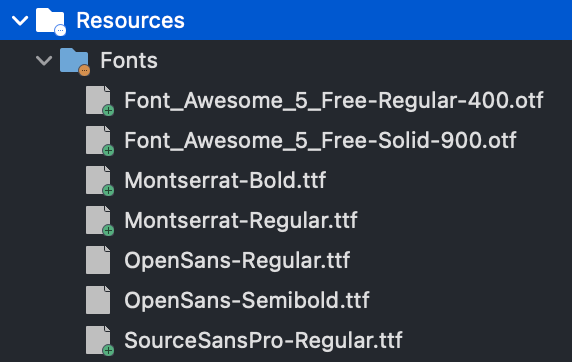

1. Highlight all of the font files in the `Resources\Fonts` folder and set the `Build Action` to `MauiFont`
    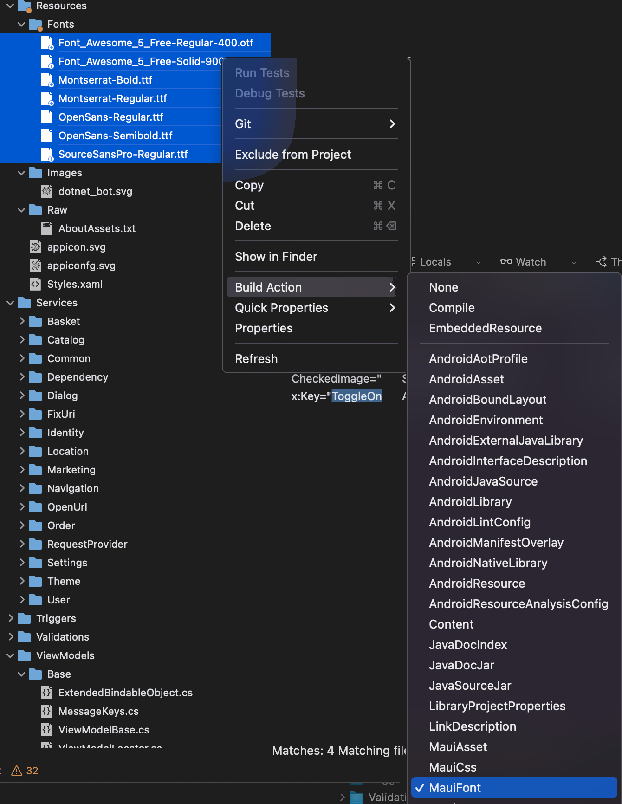

1. Update `MauiProgram.cs` to include our migrated fonts

    ```csharp
    using CommunityToolkit.Maui;
    
    namespace eShopOnContainers;
    
    public static class MauiProgram
    {
        public static MauiApp CreateMauiApp()
        {
            var builder = MauiApp.CreateBuilder();
            builder
                .UseMauiApp<App>()
                .ConfigureEffects(
                    effects =>
                    {
                    })
                .UseMauiCommunityToolkit()
                .ConfigureFonts(
                    fonts =>
                    {
                        fonts.AddFont("OpenSans-Regular.ttf", "OpenSansRegular");
                        fonts.AddFont("OpenSans-Semibold.ttf", "OpenSansSemibold");
    
                        fonts.AddFont("Font_Awesome_5_Free-Regular-400.otf", "FontAwesome-Regular");
                        fonts.AddFont("Font_Awesome_5_Free-Solid-900.otf", "FontAwesome-Solid");
                        fonts.AddFont("Montserrat-Bold.ttf", "Montserrat-Bold");
                        fonts.AddFont("Montserrat-Regular.ttf", "Montserrat-Regular");
                        fonts.AddFont("SourceSansPro-Regular.ttf", "SourceSansPro-Regular");
                        fonts.AddFont("SourceSansPro-Solid.ttf", "SourceSansPro-Solid");
                    });
    
            return builder.Build();
        }
    }
    ```

## Image Migration

In Xamarin.Forms, images would often be registered on the individual platforms. This application has existing images we can migrate from the iOS, Android, or UWP application. For this example,  I will be using images from the `eShopOnContainers\eShopOnContainers.Droid\Resources\drawable` folder.

1. Copy the images from the existing Xamarin.Forms application over to the `Resources\Images` folder in your MAUI project.
   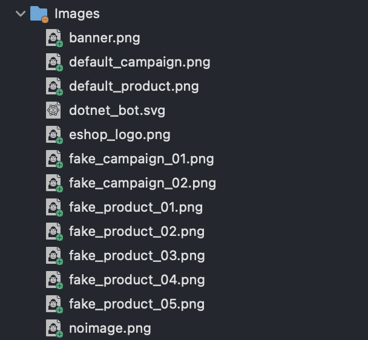

1. Highlight all of the font files in the `Resources\Images` folder and set the `Build Action` to `MauiImage`
    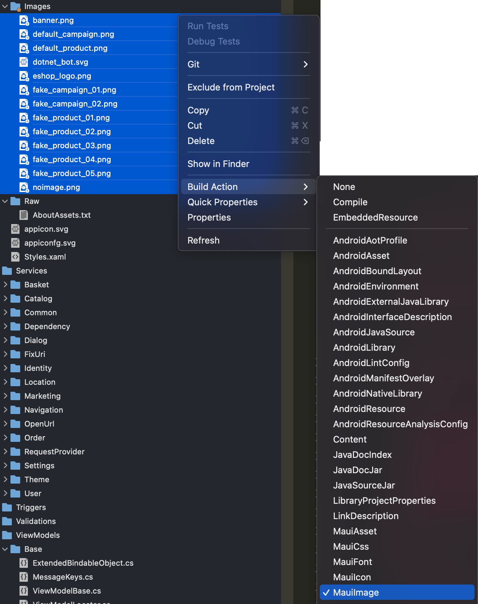